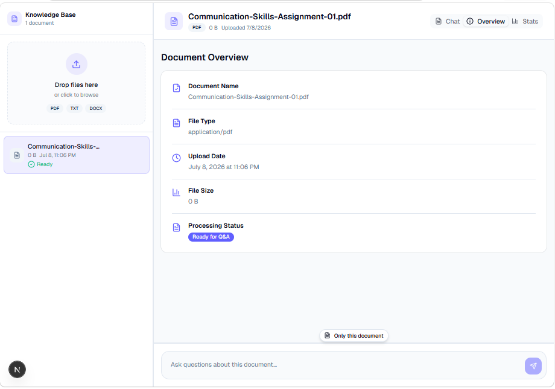
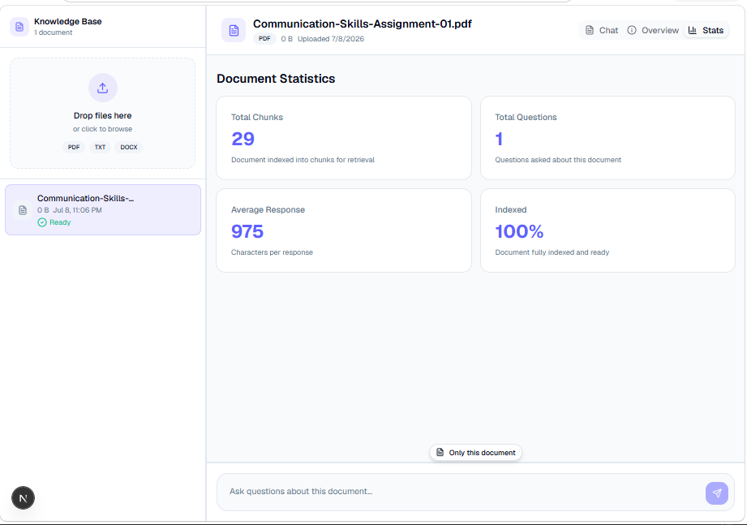

# 🧠 DocuMind AI

## Intelligent Document Q&A Assistant with Memory and Multi-Document Search

DocuMind AI is a complete AI-powered document assistant that allows users to upload documents, ask questions in natural language, receive real-time answers, continue follow-up conversations, and search across multiple files.

Instead of manually reading long documents, users can simply upload their files and start a conversation.

---

# 🎥 Watch the Demo

## ▶️ [Click Here to Watch the Full DocuMind AI Demo](assets/DocuMind_video.mp4)

The demo shows the complete application in action, including:

* Document upload and processing
* AI-powered question answering
* Real-time streaming responses
* Follow-up conversation memory
* Source references
* Current-document search
* Multi-document search
* Document overview
* Document statistics
* LangSmith AI workflow tracing

---

# 💡 The Problem

Long documents can take a lot of time to read and search manually.

Finding one specific answer may require checking:

* Multiple PDF files
* Business reports
* Technical documents
* Research papers
* Company knowledge files
* Policies and procedures

DocuMind AI makes this process much easier.

Users can simply ask:

> What are the main points in this document?

> Summarize this file in simple words.

> Explain the second point.

> Compare the main topics across all uploaded documents.

The system searches the relevant document content and provides a clear answer.

---

# ✨ What DocuMind AI Can Do

## 📄 Upload Multiple Document Types

Users can upload:

* PDF files
* DOCX files
* TXT files

Each document is automatically processed and prepared for question answering.

The user does not need to manually organize or search the document.

---

# 💬 Ask Questions About Documents

After uploading a document, the user can ask questions in natural language.

For example:

> Summarize this document in five simple points.

> What are the most important findings?

> What does this document say about the main topic?

> Explain this in simple words.

DocuMind AI searches the document and generates a relevant answer.

---

# ⚡ Real-Time Streaming Answers

Answers appear in real time while they are being generated.

The user does not need to wait for the complete response before seeing the result.

This creates a fast and natural chat experience.

---

# 🧠 Follow-Up Conversation Memory

DocuMind AI remembers the previous conversation.

For example:

**User:**

> Who is the main person mentioned in this document?

**DocuMind AI:**

> The main person mentioned is John Smith.

**User:**

> What is his role?

The application understands that **"his"** refers to **John Smith**.

Users can continue asking follow-up questions without repeating all the previous information.

---

# 💾 Saved Conversations

Each document keeps its own conversation history.

This means:

* One document has its own chat
* Another document has a separate chat
* Switching between documents does not remove previous conversations
* Refreshing the browser does not remove saved chats
* Restarting the backend does not remove saved conversations

Users can return to a document and continue where they left off.

---

# 🔍 Search the Current Document

Users can choose to search only inside the selected document.

This is useful when they want a focused answer from one specific file.

For example:

> What are the key findings in this document?

Only the selected document is searched.

---

# 📚 Search Across All Documents

Users can also search across all uploaded documents.

This is useful for questions such as:

> Compare the main topics in all uploaded documents.

> What information is common across these files?

> Which document discusses this topic?

The system searches across the available document knowledge base and finds the most relevant information.

---

# 📌 Answers with Source References

DocuMind AI does more than generate an answer.

It also shows the relevant sources used to create that answer.

References can include:

* Document name
* Page number
* Chunk number
* Relevant text snippet

This helps users understand where the information came from.

---

# 🖥️ Chat Experience

The main Chat section allows users to:

* Ask questions
* Receive streaming answers
* Continue follow-up conversations
* View source references
* Switch between one-document and all-document search

---

# ℹ️ Document Overview

The Overview tab gives users quick information about the selected document.

It displays:

* Document name
* File type
* Upload date
* File size
* Processing status

This makes it easy to check whether a document is ready for question answering.

---

# 📊 Document Statistics

The Stats tab provides a quick view of document and conversation activity.

It displays:

* Total document chunks
* Total questions asked
* Average response length
* Document indexing status

---

# ✂️ Intelligent Document Processing

When a document is uploaded, DocuMind AI automatically:

1. Reads the document content
2. Divides the text into useful sections
3. Converts those sections into searchable AI representations
4. Stores them in a vector database
5. Finds the most relevant content when a question is asked
6. Sends only the useful context to the AI model
7. Streams the final answer back to the user

The complete experience happens behind a simple chat interface.

---

# 🔄 Smart Follow-Up Question Understanding

Follow-up questions are improved before document search.

For example:

**Previous question:**

> Who is John Smith?

**Follow-up question:**

> What is his experience?

DocuMind AI can understand the context and search for:

> What is John Smith's experience?

This improves the quality of document retrieval and makes conversations more natural.

---

# ♻️ Duplicate File Detection

DocuMind AI can identify when the same file has already been processed.

When a document is uploaded, the application creates a unique file fingerprint.

If the same document is uploaded again, the system can reuse previously processed data instead of repeating the complete document processing workflow.

This helps reduce unnecessary work and improves speed.

---

# 💾 Persistent Document Storage

The document search indexes are saved locally.

This means documents do not disappear simply because the backend restarts.

When the application starts again, previously saved documents can be loaded automatically and shown in the application.

---

# 🗑️ Complete Document Management

Users can delete documents directly from the application.

When a document is deleted, it is removed from:

* The document list
* Active document search
* Multi-document search
* Saved vector storage
* Saved conversation history

This keeps the knowledge base clean and organized.

---

# 🛡️ Grounded Answers

DocuMind AI is designed to answer document questions using retrieved document information.

The application follows important rules:

* Do not invent missing information
* Do not add unsupported facts
* Keep answers clear and concise
* Keep technical references separate from the main answer
* Clearly say when information cannot be found

When the information is unavailable, the system can respond:

> I couldn't find this information in the uploaded document.

---

# 👋 Natural Chat Experience

Simple messages are handled naturally.

For example:

> Hi

> Hello

> Thanks

> Who are you?

> What can you do?

The assistant responds without unnecessarily searching the document database.

---

# 🔬 AI Workflow Monitoring with LangSmith

The complete AI workflow is traced using LangSmith.

This provides visibility into important steps such as:

* User question processing
* Conversation history
* Follow-up question rewriting
* Document retrieval
* Relevant context selection
* AI model generation
* Streaming responses
* Source generation

This makes the AI system easier to understand, test, and improve.

---

# 🚀 Key Features

✅ PDF, DOCX, and TXT document support

✅ AI-powered document question answering

✅ Real-time streaming responses

✅ Follow-up conversation memory

✅ Saved chat history

✅ Separate chat history for every document

✅ Current-document search

✅ Multi-document search

✅ Source references

✅ Intelligent document chunking

✅ Semantic document search

✅ Persistent FAISS vector storage

✅ Duplicate file detection

✅ Document deletion

✅ LangSmith tracing and observability

✅ Modern responsive interface

✅ Chat, Overview, and Stats sections

---

# 🎯 Real-World Use Cases

DocuMind AI can be adapted for many practical business needs.

## 🏢 Company Knowledge Assistant

Employees can search internal documents, policies, procedures, and company information.

## 📚 Research Assistant

Researchers can ask questions about papers, reports, and long documents.

## ⚖️ Legal Document Search

Users can quickly search large legal documents and supporting files.

## 🎓 Study Assistant

Students can upload study material and ask questions about difficult topics.

## 🛠️ Technical Documentation Assistant

Teams can search product manuals, API documentation, and technical guides.

## 💼 Business Report Analysis

Users can search and compare information across company reports.

## 🤝 Customer Support Knowledge Base

Support teams can quickly find answers from company documentation.

---

# 🛠️ Technology Behind DocuMind AI

DocuMind AI combines modern frontend, backend, AI, and retrieval technologies.

## Frontend

**Next.js**
Used to build the modern web application.

**React**
Used for interactive chat and document features.

**TypeScript**
Used for reliable frontend development.

**Tailwind CSS**
Used to create the responsive user interface.

**shadcn/ui**
Used for professional interface components.

---

## Backend

**FastAPI**
Handles document uploads, chat requests, document management, and streaming responses.

---

## AI and Document Search

**Google Gemini**
Generates clear answers using relevant document context.

**LangChain**
Connects retrieval, prompts, conversation memory, and the AI model.

**HuggingFace Embeddings**
Transforms document text into semantic vector representations.

**FAISS**
Provides fast similarity search across document content.

---

## AI Observability

**LangSmith**
Traces and monitors the complete AI and RAG workflow.

---

# 🏆 Project Highlights

DocuMind AI is more than a basic document chatbot.

It combines:

* A complete document processing workflow
* Semantic AI search
* Real-time answer streaming
* Conversation memory
* Follow-up question understanding
* Search across multiple documents
* Saved vector storage
* Saved conversation history
* Duplicate file detection
* Source references
* AI workflow tracing

All of these features are combined inside one clean and easy-to-use application.

---

# 🎥 See DocuMind AI in Action

## ▶️ [Watch the Full Demo Video](assets/DocuMind_video.mp4)

The video demonstrates the complete user experience from document upload to AI-powered answers.

---

# 🧠 DocuMind AI

### Upload documents. Ask questions. Find answers.

**Built with Next.js, FastAPI, LangChain, HuggingFace, FAISS, Google Gemini, and LangSmith.**
